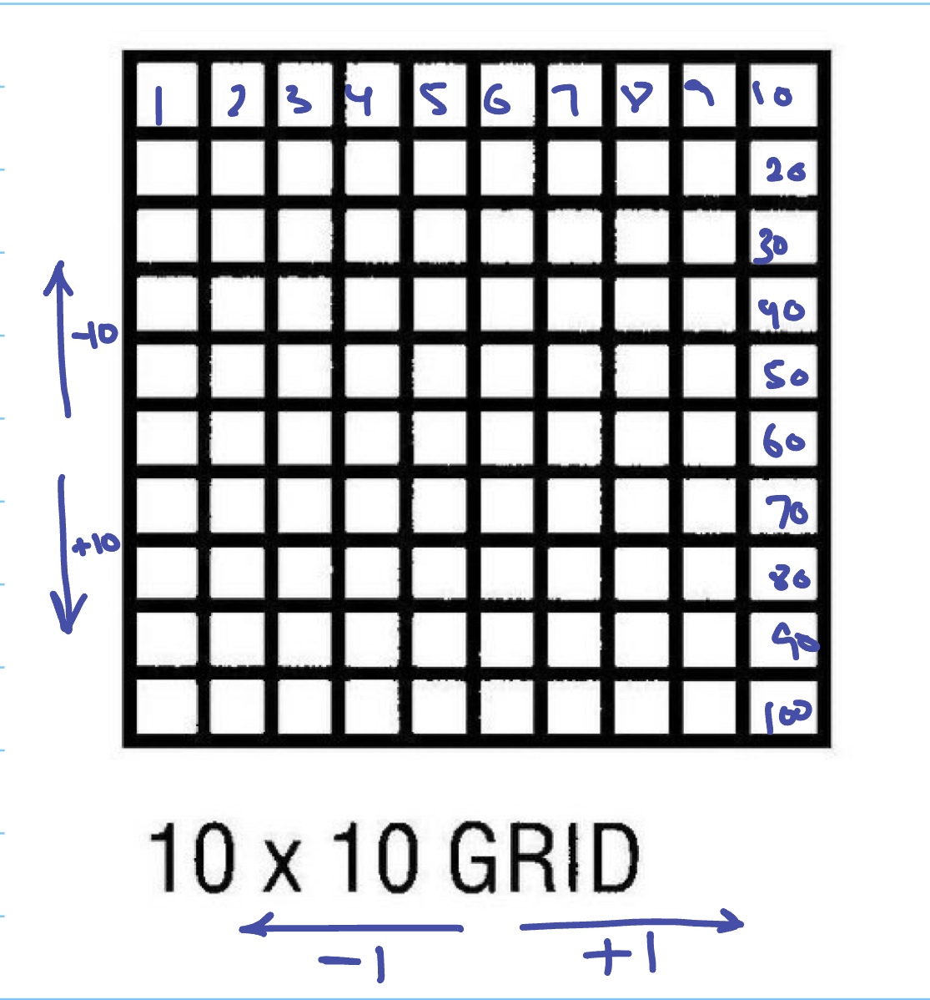

# Snake Game
[](https://forthebadge.com)

Snake Game is a game I developed using HTML, CSS and jQuery. This is a recreation of the arcade game developed by Gremlin that brings back that nostalgic, retro feel of that time period. The game is also responsive and can be played on mobile devices. I started by setting up the game board and creating the snake's movement using event handlers. I also implemented the scoring system and added sound effects to enhance the player's experience.

To play the game, here's a deployed version of it: [Snake Game](https://snakesss.surge.sh/)

## Table of Contents

1. Technologies Used
2. Wireframe and User Stories
3. Planning Process
4. Problem Solving Strategy
5. Unsolved Problems
6. Winner
7. Favourite Function

## Technologies Used

- HTML
- CSS
- JavaScript
- jQuery

## Wireframe and User Stories

### Wireframe

[Wireframe in Figma](https://www.figma.com/file/38UcTsLf80VQCMfGSh1fpW/Snake-Game?type=design&node-id=0%3A1&t=mAejuMGM1gPmnO1a-1)

### User Stories

[User stories in Trello](https://trello.com/invite/b/cVIHqedt/ATTIe9773a5d745292979db5d888f6607a9f0FB2B392/project-1)


## Planning Process
- Created a standard 10x10 grid for ease of calculation 


- Created functions for actions that I want to automate such as snake moving, generating an apple, checking for borders and hitting the snake or eating an apple, creating the grid and event key listeners. 


- Initialised all the variables I'll be needing using jQuery and started with function moveSnake() and used array methods to manipulate array (snake). A div turns into a 'snake' when a class is added.

- Created outcomes() to check for any listed outcomes above every second

- Created a function to randomly generate apple at different positions using Math methods and added event listeners for arrow keys

- After the logic and base functionality worked, I proceeded to add audio tags and make it responsive by adding buttons 

## Problem Solving Strategy

To solve any bugs that I had, I made sure to console.log at each step before proceeding then debugging everything as I put all the functions together. If I encountered any bugs I couldn't solve, I would search online on what the error means (ran into a lot of type errors because I was using JS methods on jQuery)

## Unsolved Problems

- Pressing the keys too fast causes the snake to eat itself (pressing up then right) instead of making a full U-turn. I'd add a 'key buffer' as recommended [here](https://stackoverflow.com/questions/43032014/prevent-snake-from-going-in-reverse-direction)

- Mobile version of the game doesn't have the keyInputs array so snake can go back on itself

## Winner

- There is no winner but the game keeps track of your highest score!

## Favourite Function

- My favourite function to work with was outcomes() because it dealt a lot with maths! I had to plan out what the grid looked like and what conditions it would need to detect that the snake is out of bounds. 
```js
    snakeHead = currentSnake.length - 1

        if(

            (currentSnake[snakeHead] + rowJump > 99 && direction === 10) || // hit bottom (there are 99 boxes in grid)
            (currentSnake[snakeHead] - rowJump < 0 && direction === -10) || // hit top
            (currentSnake[snakeHead] % rowJump === 9 && direction === 1) || //  heading towards right wall and still heading right
            (currentSnake[snakeHead] % rowJump === 0 && direction === -1) //  heading towards left wall and still heading left

        ) {    deathSound.play()
           
            stopGame()
            playAgainPopup()
        }

```

- For example, to detect the bottom border, take index of snake's head and check if the snake wants to move down a row (direction is 10) but adding a row to the snake's head index causes it to be more than 99 then it is hitting a border

- To detect the right border, if the snake is heading right, check if it is at the end of the row (check if index ends with 9) then it will hit the right wall

